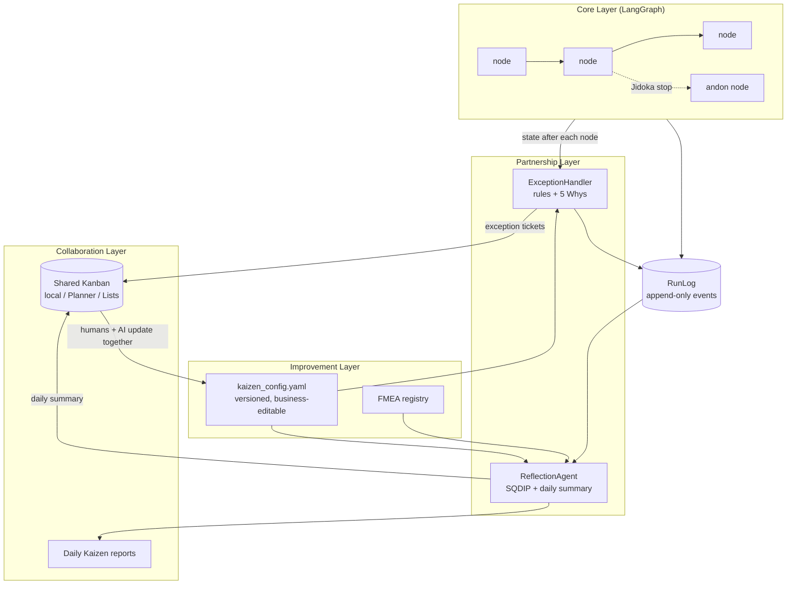

# AI Jidoka Framework — Architecture

## High-level overview

The framework extends LangGraph with a Kaizen layer. Four layers, one loop:

- **Core Layer** — your LangGraph workflow (plain node functions over state).
- **Partnership Layer** — Reflection Agent, Exception Handler, Kanban integration.
- **Improvement Layer** — versioned config (rules, prompts, standard work), FMEA registry, sandbox mode.
- **Collaboration Layer** — the shared Kanban board (local / Planner / Lists) and daily Kaizen reports.

## Key components

| Component | Module | Responsibility |
|---|---|---|
| `KaizenGraphBuilder` | `kaizen_graph.py` | Wraps `StateGraph`; instruments every node with abnormality detection, error capture, and a Jidoka gate that diverts to the `andon` node on a stop |
| `KaizenState` | `kaizen_graph.py` | TypedDict mixin adding `kaizen_run_id`, `kaizen_stopped`, `kaizen_stop_reason`, `kaizen_exceptions` |
| `ExceptionHandler` / `AbnormalityRule` | `exception_handler.py` | Evaluates config-defined rules after each node; produces `ExceptionRecord`s with a 5 Whys scaffold; decides stops by severity |
| `FMEARegistry` / `FMEAEntry` | `exception_handler.py` | Anticipated failure modes ranked by RPN, folded into daily reflections |
| `KanbanBoard` + providers | `kanban_integration.py` | `LocalKanbanBoard` (JSON), `PlannerKanbanBoard`, `ListsKanbanBoard` (Microsoft Graph); implement the ABC for anything else |
| `ReflectionAgent` | `reflection_agent.py` | Computes the SQDIP snapshot from the run log, writes the daily Kaizen summary (optionally LLM-narrated), posts it to the board |
| `SenseiAgent` | `sensei_agent.py` | Socratic review of 5 Whys analyses (vague problems, blame, weak countermeasures); coaches open exception tickets |
| `InvestigationGraphBuilder` | `investigation_graph.py` | Turns an exception ticket into a checkpointed investigation flow (living A3) with non-optional human gates and the Sensei as the Jidoka layer on the thinking |
| `KaizenConfig` | `config.py` | Single YAML file for rules, prompts, SQDIP targets, and human standard work; every save bumps the version and archives the old file |
| `RunLog` | `runlog.py` | Append-only JSONL event log — the single source of truth for metrics |

## Data flow

1. **Process runs.** `graph.invoke()` brackets the run with `run_started` /
   `run_completed` events; each node completion is logged.
2. **Exceptions trigger Jidoka.** After each node, rules are evaluated against
   the merged state. Abnormalities become run-log events and Kanban tickets;
   at or above `jidoka.stop_on_severity`, the flow routes to the `andon` node
   and the run records `run_stopped`.
3. **Daily reflection runs.** The Reflection Agent computes SQDIP from the run
   log (Inventory comes from open ticket count on the board), summarizes
   exception patterns, adds FMEA top risks, and posts the summary to the
   "Daily Kaizen" bucket.
4. **Joint Kaizen kata improves the system.** Humans and AI review the summary,
   run a 5 Whys on one pattern, and standardize the countermeasure — usually
   as an edit to `kaizen_config.yaml`, trialed first in sandbox mode.
5. **Deep problems become investigation flows.** An exception ticket spawns a
   checkpointed LangGraph (`frame_problem → collect_data → brainstorm_causes →
   five_whys → sensei_gate → design_countermeasure → verify → standardize`).
   Every stage pauses on `interrupt()` for human input; the Sensei gate loops
   weak analyses back with socratic questions (override after three rounds is
   possible but recorded). The completed A3 is written back to the ticket —
   the ticket ID is the flow's thread ID, so board and flow are two views of
   the same investigation.

## Design decisions

- **One event log, one config.** Everything the Reflection Agent reports is
  derivable from `kaizen_runlog.jsonl`; everything the team can tune lives in
  `kaizen_config.yaml`. Both are plain files a business user can open.
- **Stops are data, not exceptions.** A Jidoka stop is a normal graph outcome
  (`kaizen_stopped: True`), so callers can render andon status, retry after
  countermeasures, or escalate — nothing is thrown past them.
- **Optional everything.** LLM narration, Microsoft 365 boards, and FMEA are
  additive; the core loop works with zero credentials and zero network access.
- **Auth stays outside.** Graph-backed boards take a `token_provider` callable
  so each organization brings its own credential flow.
